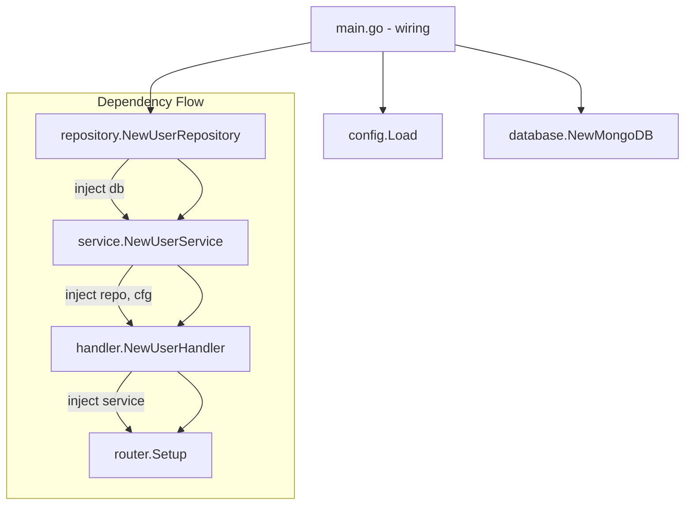

# Dependency Injection in Go

## Overview

Go prefers **manual constructor injection** over DI containers. No frameworks, no magic - just plain Go code.

## How Manual DI Works

```go
// 1. Define interfaces
type UserRepository interface {
    FindByID(ctx context.Context, id string) (*User, error)
}

// 2. Create structs that depend on interfaces
type UserService struct {
    repo UserRepository  // Depends on interface, not concrete type
}

// 3. Constructor accepts dependencies
func NewUserService(repo UserRepository) *UserService {
    return &UserService{repo: repo}
}

// 4. Wire everything in main.go
func main() {
    repo := repository.NewUserRepository(db)
    service := service.NewUserService(repo)      // Inject repo
    handler := handler.NewUserHandler(service)   // Inject service
}
```

## Benefits

| Benefit              | Description                        |
| -------------------- | ---------------------------------- |
| Explicit             | You see exactly how things connect |
| Compile-time safe    | Missing dependency = compile error |
| No magic             | Plain Go code, easy to understand  |
| Easy testing         | Pass mocks directly in tests       |
| Fast startup         | No reflection overhead             |
| No framework lock-in | Works with any Go project          |

---

## Pattern in This Project

### Architecture



### Example: main.go

```go
func main() {
    // Load config
    cfg := config.Load()

    // Database
    db := database.NewMongoDB(cfg.MongoURI, cfg.MongoDatabase)
    defer db.Close()

    // Repository layer
    userRepo := repository.NewUserRepository(db.Database)

    // Service layer (depends on repository)
    userService := service.NewUserService(userRepo, cfg)

    // Handler layer (depends on service)
    userHandler := handler.NewUserHandler(userService)

    // Router (depends on handlers)
    r := router.Setup(userHandler)

    // Start server
    r.Run(":" + cfg.ServerPort)
}
```

---

## Testing with Manual DI

```go
func TestUserService_GetUser(t *testing.T) {
    // Create mock repository
    mockRepo := &MockUserRepository{
        users: map[string]*User{
            "123": {ID: "123", Name: "John"},
        },
    }

    // Inject mock into service
    service := NewUserService(mockRepo, &config.Config{})

    // Test
    user, err := service.GetUser(context.Background(), "123")

    assert.NoError(t, err)
    assert.Equal(t, "John", user.Name)
}
```

---

## Context Passing vs DI

Go passes `context.Context` explicitly rather than injecting it:

```go
// Go: Explicit context passing
func (s *UserService) GetUser(ctx context.Context, id string) (*User, error) {
    return s.repo.FindByID(ctx, id)
}

// NestJS: Injected context
@Injectable({ scope: Scope.REQUEST })
class UserService {
    constructor(@Inject(REQUEST) private ctx: Request) {}
}
```

**Why Go does this:**
- Explicit is better than implicit
- Easy to trace context flow
- Cancellation propagates clearly
- No hidden dependencies

---

## Summary

Go's approach: **Keep it simple.**

- Use constructor functions to inject dependencies
- Wire everything explicitly in `main.go`
- Pass `context.Context` as the first parameter
- No frameworks needed
