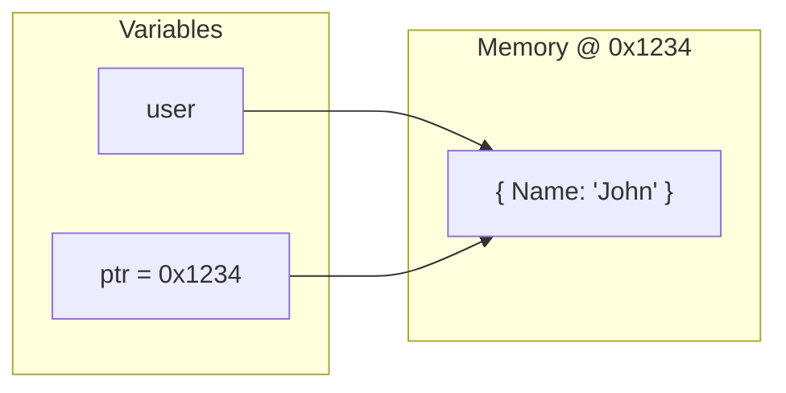

# Pointers in Go

## Quick Reference

| Symbol  | Name         | Meaning                              |
| ------- | ------------ | ------------------------------------ |
| `&`     | Address-of   | "Give me the memory address of this" |
| `*`     | Dereference  | "Give me the value at this address"  |
| `*Type` | Pointer type | "A pointer to Type"                  |

---

## Visual Example

```go
user := User{Name: "John"}   // user lives at memory address 0x1234

ptr := &user                 // ptr = 0x1234 (the address)
                             // ptr is type *User (pointer to User)

name := (*ptr).Name          // Go to address, get the value
                             // name = "John"
```



---

## Value vs Pointer

### Value (Copy)

```go
func updateName(u User) {
    u.Name = "Jane"  // Changes the COPY only
}

user := User{Name: "John"}
updateName(user)
fmt.Println(user.Name)  // Still "John"
```

### Pointer (Original)

```go
func updateName(u *User) {
    u.Name = "Jane"  // Changes the ORIGINAL
}

user := User{Name: "John"}
updateName(&user)       // Pass address
fmt.Println(user.Name)  // Now "Jane"
```

---

## Receiver Methods

```go
// Value receiver - cannot modify
func (u User) GetName() string {
    return u.Name
}

// Pointer receiver - can modify
func (u *User) SetName(name string) {
    u.Name = name
}
```

**Rule of thumb:** Use pointer receiver `*T` for 90% of methods.

---

## Common Patterns

### Constructor Pattern

```go
func NewUser(name string) *User {
    return &User{
        Name: name,
    }
}

// Usage
user := NewUser("John")  // user is *User
```

**Why return `*User` instead of `User`?**
- Avoids copying the struct
- Caller can modify it
- Consistent with other constructors
- Can return `nil` to indicate failure

### Checking for nil

```go
func GetUser(id string) *User {
    user, found := db.Find(id)
    if !found {
        return nil  // No user found
    }
    return user
}

// Usage
user := GetUser("123")
if user == nil {
    fmt.Println("User not found")
    return
}
fmt.Println(user.Name)
```

---

## When to Use Pointers

| Use Pointer `*T`                          | Use Value `T`                |
| ----------------------------------------- | ---------------------------- |
| Method needs to modify receiver           | Method only reads data       |
| Struct is large (many fields)             | Struct is small (1-3 fields) |
| Need to represent "no value" (nil)        | Always has a value           |
| Consistency (if one method needs pointer) | Small immutable types        |

---

## Common Mistakes

### 1. Nil Pointer Dereference

```go
var user *User  // nil by default

fmt.Println(user.Name)  // PANIC! Can't access nil
```

**Fix:** Always check for nil first.

```go
if user != nil {
    fmt.Println(user.Name)
}
```

### 2. Forgetting `&` When Passing to Pointer Parameter

```go
func UpdateUser(u *User) { ... }

user := User{Name: "John"}
UpdateUser(user)   // ERROR: cannot use User as *User
UpdateUser(&user)  // Correct
```

### 3. Modifying Loop Variable

```go
users := []User{{Name: "John"}, {Name: "Jane"}}

// WRONG - modifies copy
for _, u := range users {
    u.Name = "Updated"  // Does nothing!
}

// CORRECT - use index
for i := range users {
    users[i].Name = "Updated"
}
```

---

## Pointer vs Value Cheatsheet

```go
// Creating
user := User{Name: "John"}      // Value (User)
userPtr := &User{Name: "John"}  // Pointer (*User)

// Converting
ptr := &user     // Value → Pointer
val := *ptr      // Pointer → Value

// Function parameters
func ByValue(u User) {}    // Gets copy
func ByPointer(u *User) {} // Gets address, can modify

// Calling
ByValue(user)              // Pass value
ByPointer(&user)           // Pass address
ByPointer(userPtr)         // Already a pointer

// Methods
func (u User) Read() {}    // Value receiver
func (u *User) Write() {}  // Pointer receiver

// Go auto-converts for method calls
user.Write()    // Go converts to (&user).Write()
userPtr.Read()  // Go converts to (*userPtr).Read()
```

---

## Summary

| Concept      | Syntax       | Example              |
| ------------ | ------------ | -------------------- |
| Get address  | `&value`     | `ptr := &user`       |
| Get value    | `*pointer`   | `val := *ptr`        |
| Pointer type | `*Type`      | `var ptr *User`      |
| Nil check    | `ptr == nil` | `if user == nil { }` |
