# Logout Strategies

This document compares two approaches for implementing secure logout in JWT-based authentication systems.

## Overview

| Approach                 | Server-Side Instant | Client-Side Instant | Stolen Token Protected |
| ------------------------ | ------------------- | ------------------- | ---------------------- |
| Token Versioning + SSE   | Yes                 | Yes                 | Yes                    |
| Access/Refresh + Polling | No (15 min window)  | ~5 sec delay        | No                     |

## Approach 1: Token Versioning + SSE

### Architecture

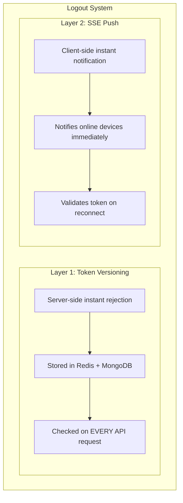

### How It Works

**Token Versioning:**

- Each user has a `tokenVersion` field (starts at 1)
- JWT includes `tokenVersion` in claims at login time
- On logout, server increments `tokenVersion`
- Auth middleware checks JWT version against stored version on every request
- Mismatch = 401 Unauthorized (instant rejection)

**SSE (Server-Sent Events):**

- Client opens persistent connection: `GET /api/v1/auth/events`
- Server pushes "logout" event when logout occurs
- Client receives event and logs out locally (instant notification)
- On reconnect, server validates token before accepting connection

### Data Model

```go
// User model
type User struct {
    ID           string `bson:"_id"`
    Email        string `bson:"email"`
    Password     string `bson:"password"`
    TokenVersion int    `bson:"tokenVersion"` // incremented on logout
}

// JWT claims
type Claims struct {
    UserID       string `json:"userId"`
    TokenVersion int    `json:"tokenVersion"` // must match stored version
    jwt.RegisteredClaims
}
```

### Flow Diagrams

**Login Flow:**

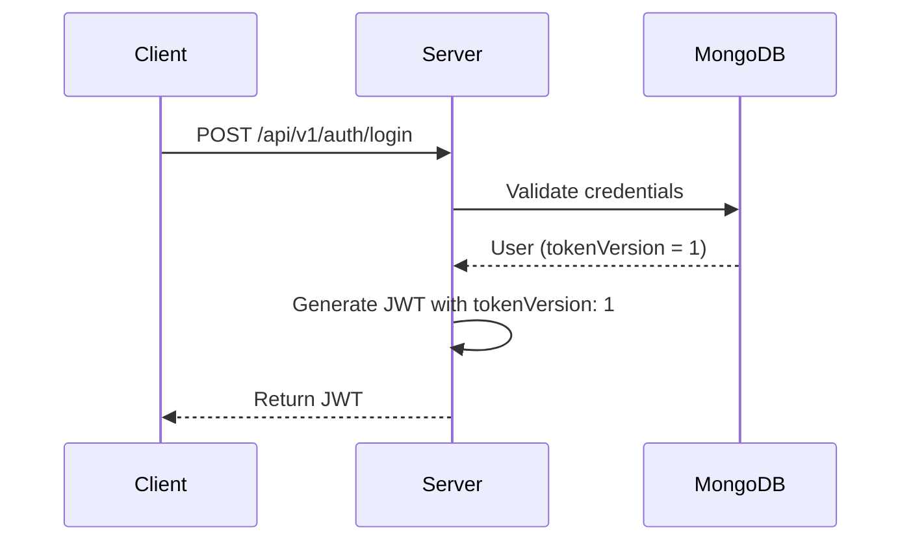

**Logout Flow:**

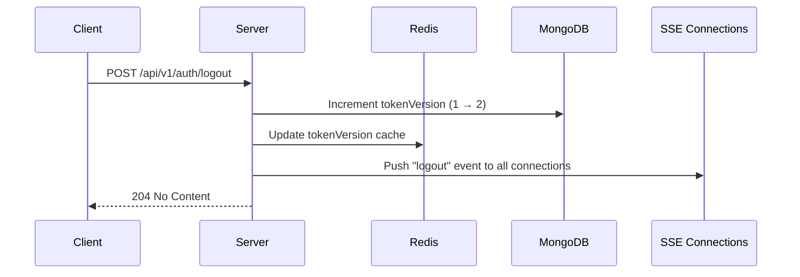

**API Request Flow (Auth Middleware):**

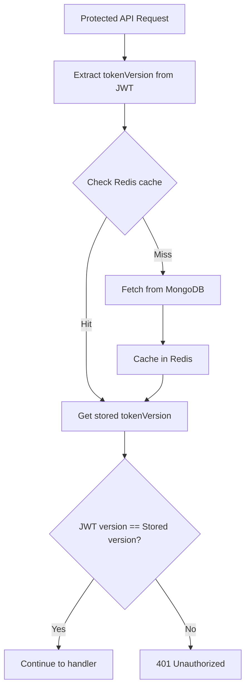

**SSE Connection Flow:**

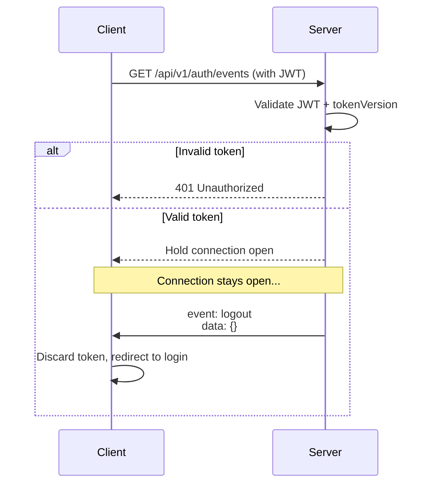

**Offline Device Reconnect:**

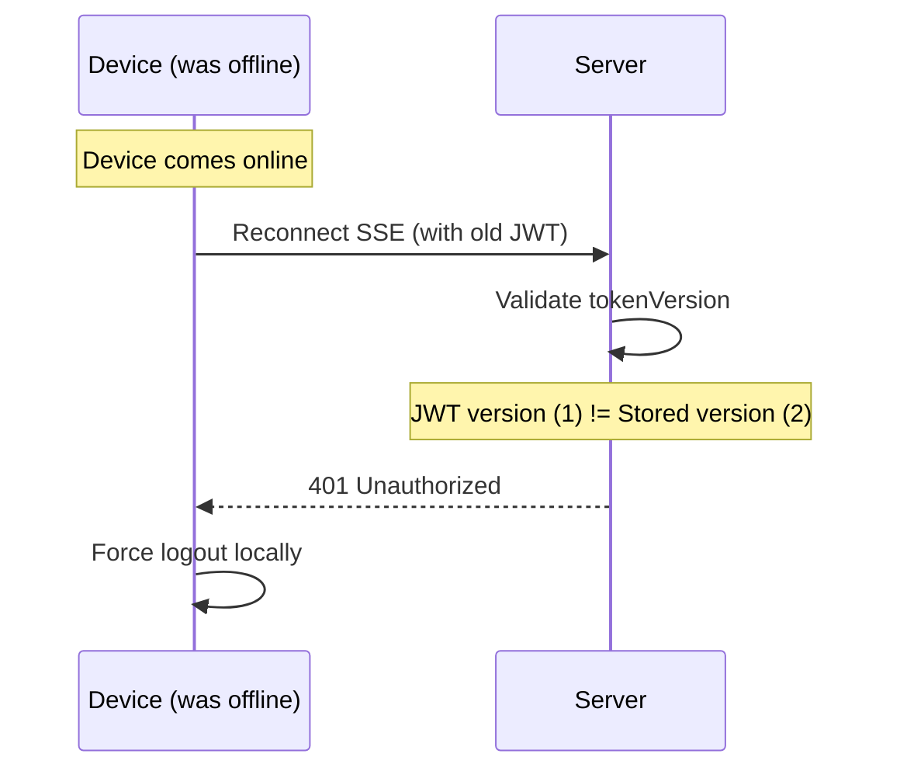

### Scenario Coverage

| Scenario                           | What Catches It                    |
| ---------------------------------- | ---------------------------------- |
| Device online at logout time       | SSE push (instant)                 |
| Device offline, comes online       | SSE reconnect validation (instant) |
| Device makes API call after logout | Token versioning (instant)         |
| All else fails                     | Token expiry (eventual)            |

### Pros and Cons

**Pros:**

- True instant logout (server + client)
- Stolen tokens rejected immediately
- Single token type (simpler)
- "Logout everywhere" built-in

**Cons:**

- Redis/DB check on every request
- Requires SSE infrastructure
- Single logout scope (all devices at once)

---

## Approach 2: Access Token + Refresh Token + Polling

### Architecture

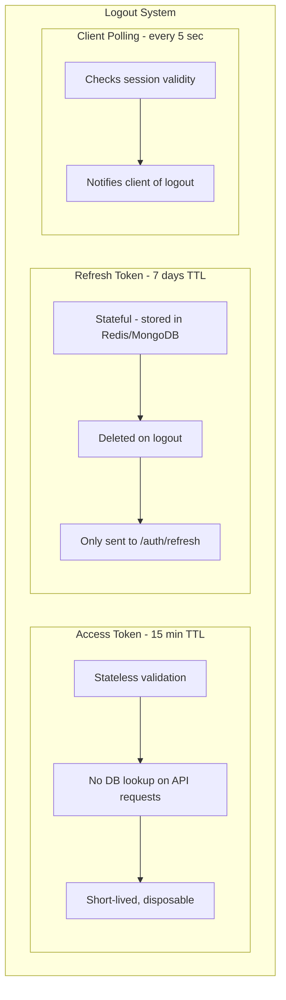

### How It Works

**Two Token Types:**

- Access Token: Short-lived (15 min), stateless, used for API calls
- Refresh Token: Long-lived (7 days), stateful, used only to get new access tokens

**Logout:**

- Delete refresh token from server
- Access token remains valid until expiry (up to 15 min)
- Client polling detects logout and discards tokens locally

**Polling:**

- Client calls `/auth/session-valid` every N seconds
- Server checks if refresh token exists
- If not, client logs out locally

### Data Model

```go
// Access Token claims (stateless)
type AccessClaims struct {
    UserID string `json:"userId"`
    jwt.RegisteredClaims // includes exp
}

// Refresh Token (stored in Redis/MongoDB)
type RefreshToken struct {
    Token     string    `bson:"token"`
    UserID    string    `bson:"userId"`
    ExpiresAt time.Time `bson:"expiresAt"`
}
```

### Flow Diagrams

**Login Flow:**

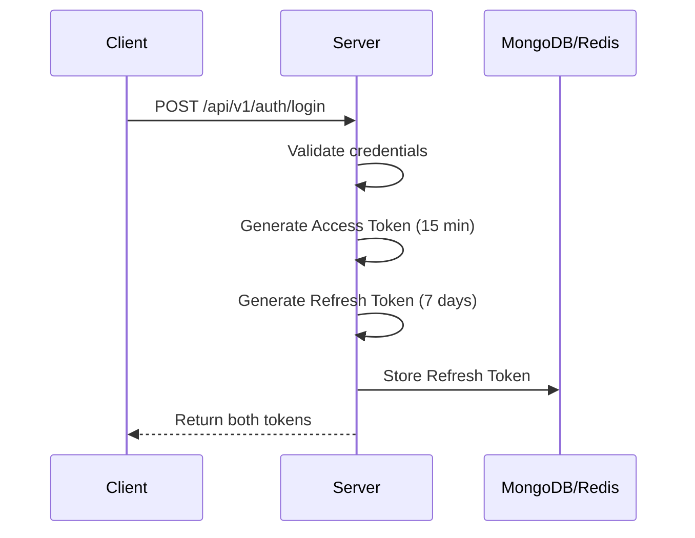

**API Request Flow:**

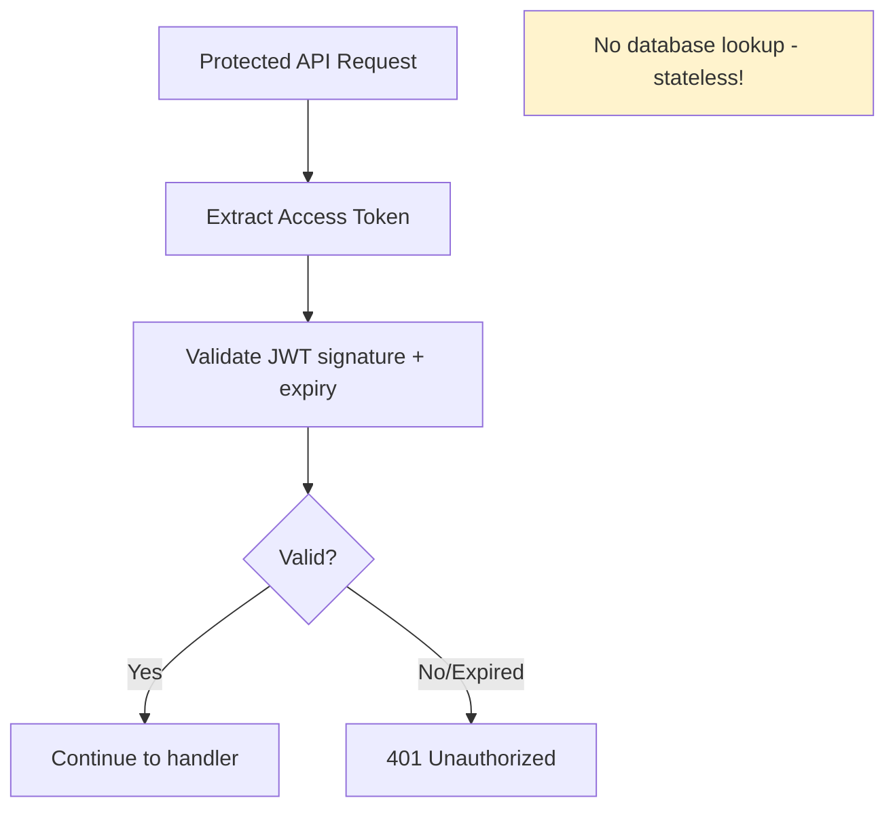

**Token Refresh Flow:**

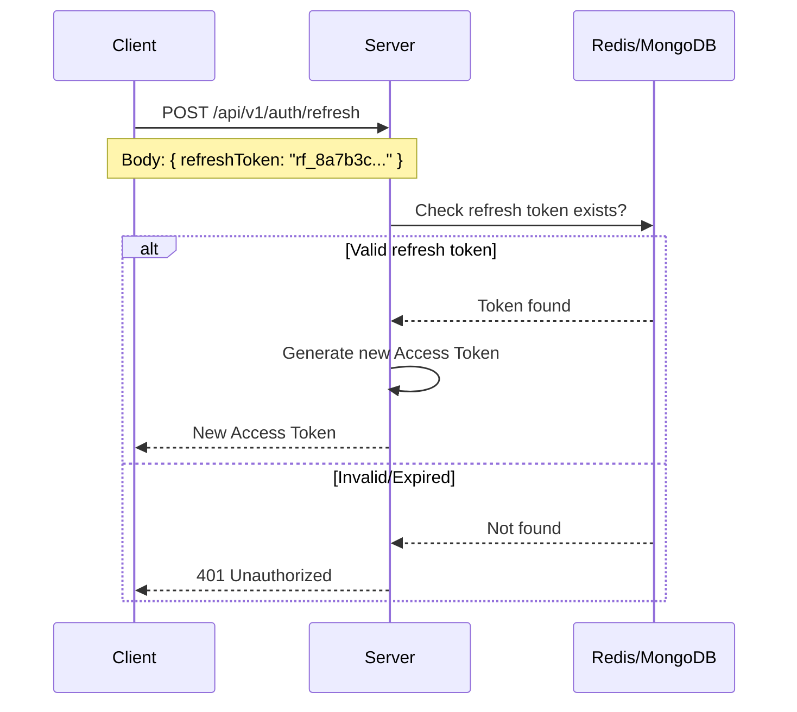

**Logout Flow:**

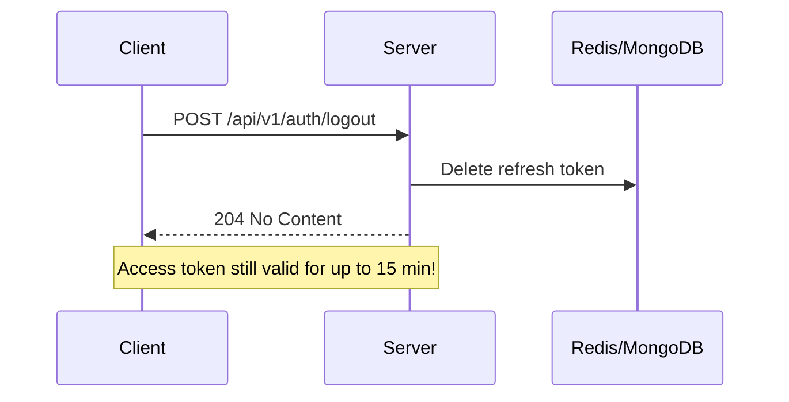

**Polling Flow:**

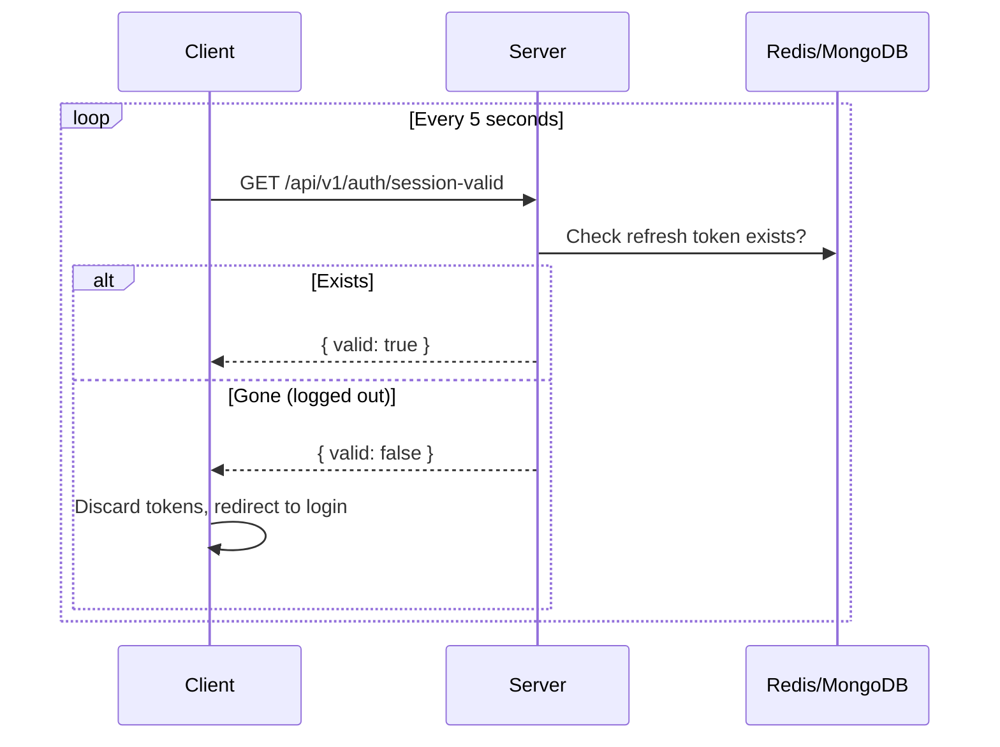

### Timeline After Logout

```mermaid
gantt
    title Timeline After Logout
    dateFormat HH:mm:ss
    axisFormat %H:%M:%S

    section Logout Event
    User logs out, refresh token deleted :milestone, 10:00:00, 0s

    section Honest Client
    Client polls, discovers logout       :done, 10:00:00, 3s
    Client logged out locally            :milestone, 10:00:03, 0s

    section Attacker (stolen token)
    Access token still works             :crit, 10:00:00, 15m
    Access token expires                 :milestone, 10:15:00, 0s
    Attacker finally blocked             :done, 10:15:00, 1s
```

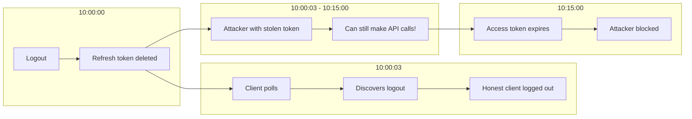

### Pros and Cons

**Pros:**

- Stateless API requests (better performance)
- Horizontal scaling easier (no shared state per request)
- Industry standard approach

**Cons:**

- 15-minute vulnerability window after logout
- Stolen tokens work until access token expires
- Polling adds network overhead
- Two token types (more complexity)
- Client notification delayed by poll interval

---

## Detailed Comparison

### Security

| Aspect                            | Token Versioning + SSE | Access/Refresh + Polling   |
| --------------------------------- | ---------------------- | -------------------------- |
| Stolen token blocked after logout | Instantly              | Up to 15 min               |
| Server trusts old tokens          | Never                  | Until access token expires |
| Attack window                     | 0 seconds              | Up to 15 minutes           |

### Performance

| Aspect                   | Token Versioning + SSE | Access/Refresh + Polling  |
| ------------------------ | ---------------------- | ------------------------- |
| DB check per API request | Yes (Redis ~1ms)       | No (stateless)            |
| Network overhead         | SSE connection         | Poll every N seconds      |
| Scalability              | Redis is bottleneck    | Better horizontal scaling |

### User Experience

| Aspect                    | Token Versioning + SSE | Access/Refresh + Polling       |
| ------------------------- | ---------------------- | ------------------------------ |
| Client notified of logout | Instantly (SSE push)   | ~5 sec delay (poll interval)   |
| Offline device handling   | Caught on reconnect    | Caught on poll after reconnect |
| Logout scope              | All devices at once    | All devices at once            |

### Implementation Complexity

| Aspect                  | Token Versioning + SSE | Access/Refresh + Polling |
| ----------------------- | ---------------------- | ------------------------ |
| Token types             | 1                      | 2                        |
| Infrastructure needed   | Redis + SSE            | Redis + Polling endpoint |
| Auth middleware changes | Check version          | Standard JWT validation  |
| Client changes          | SSE connection         | Polling loop             |

---

## Decision Guide

### Choose Token Versioning + SSE if:

- Security is top priority
- You need instant logout (server + client)
- You cannot tolerate stolen tokens working after logout
- You already have Redis infrastructure
- Use cases: Banking, healthcare, enterprise apps

### Choose Access/Refresh + Polling if:

- Performance is top priority
- You need stateless API validation
- 15-minute vulnerability window is acceptable
- You want industry-standard approach
- Use cases: Social apps, content platforms, general web apps

---

## Hybrid Approach (Advanced)

For maximum flexibility, combine both:

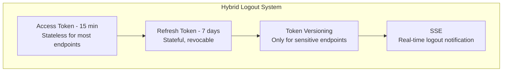

**How it works:**

- Regular endpoints: Stateless access token validation (fast)
- Sensitive endpoints: Check token version (secure)
- Logout: Revoke refresh token + increment version + SSE push

**Sensitive endpoints examples:**

- Password change
- Payment processing
- Account deletion
- Admin actions

**Hybrid Flow:**

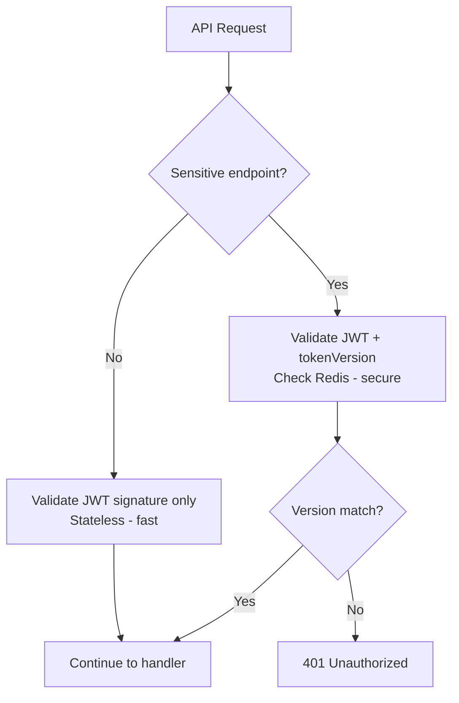

This gives you performance for most requests and instant revocation for critical actions.
