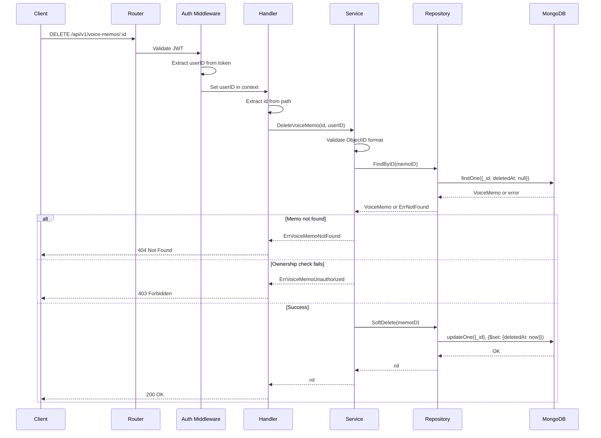

# Delete Voice Memo Specification

**Author**: Team
**Created**: 2025-12-20
**Status**: Draft
**Architecture**: Option B - Service-Level Ownership Check

## Overview

A protected endpoint that allows users to soft-delete their own voice memos by setting a `deletedAt` timestamp. The audio file remains in S3 until a future hard-delete/data retention feature is implemented.

## Architecture Decision

**Chosen Approach**: Service-Level Ownership Check

**Rationale**:
- Explicit error handling: 403 for unauthorized access, 404 for not found
- Business logic clearly separated in service layer
- Easier to extend with future permission systems (admin override, shared memos)
- Clearer audit trail for ownership violations

**Trade-offs Accepted**:
- Two database queries (fetch + update) instead of one
- Potential race condition between fetch and delete (acceptable for this use case)

## Data Model

### VoiceMemo (Updated)

| Field         | Type            | Required | Description                              |
| ------------- | --------------- | -------- | ---------------------------------------- |
| id            | ObjectID        | Yes      | MongoDB document ID                      |
| userId        | ObjectID        | Yes      | Owner of the memo                        |
| title         | string          | Yes      | Memo title                               |
| transcription | string          | No       | Transcribed text                         |
| audioFileKey  | string          | Yes      | S3 object key (internal)                 |
| audioFileURL  | string          | No       | Pre-signed URL (computed)                |
| duration      | int             | Yes      | Duration in seconds                      |
| fileSize      | int64           | Yes      | File size in bytes                       |
| audioFormat   | string          | Yes      | Audio format (mp3, wav, etc.)            |
| tags          | []string        | No       | User-defined tags                        |
| isFavorite    | bool            | No       | Favorite flag                            |
| createdAt     | time.Time       | Yes      | Creation timestamp                       |
| **deletedAt** | **\*time.Time** | **No**   | **Soft-delete timestamp (nil = active)** |

## API Endpoints

### Delete Voice Memo

**Endpoint**: `DELETE /api/v1/voice-memos/:id`
**Authentication**: Required (JWT Bearer token)
**Description**: Soft-delete a voice memo (marks as deleted, does not remove from database or S3)

#### Path Parameters

| Parameter | Type   | Required | Description                                 |
| --------- | ------ | -------- | ------------------------------------------- |
| id        | string | Yes      | Voice memo ID (MongoDB ObjectID hex string) |

#### Request

No request body required.

#### Response

**Success (200 OK)**
```json
{
  "success": true,
  "data": {
    "message": "voice memo deleted"
  }
}
```

**Forbidden (403)**
```json
{
  "success": false,
  "error": "you can only delete your own voice memos"
}
```

**Not Found (404)**
```json
{
  "success": false,
  "error": "voice memo not found"
}
```

**Internal Server Error (500)**
```json
{
  "success": false,
  "error": "internal server error"
}
```

#### Error Responses

| Status | Error                                    | Description                           |
| ------ | ---------------------------------------- | ------------------------------------- |
| 400    | invalid voice memo id format             | ID is not a valid ObjectID hex string |
| 401    | user not authenticated                   | Missing or invalid JWT token          |
| 403    | you can only delete your own voice memos | User doesn't own the memo             |
| 404    | voice memo not found                     | Memo doesn't exist or already deleted |
| 500    | internal server error                    | Database or server error              |

## Business Rules

1. **Authentication Required**: User must provide valid JWT token
2. **Ownership Verification**: User can only delete their own voice memos
3. **Soft Delete**: Sets `deletedAt` timestamp, does not remove record
4. **Idempotency**: Deleting an already-deleted memo returns 404
5. **List Filtering**: `GET /voice-memos` must exclude soft-deleted records
6. **S3 Retention**: Audio files are NOT deleted (retained for future hard-delete)

## Implementation Steps

### Files to Create
None

### Files to Modify

1. [x] `internal/models/voice_memo.go` - Add `DeletedAt` field
2. [x] `internal/errors/errors.go` - Add `ErrVoiceMemoNotFound`, `ErrVoiceMemoUnauthorized`
3. [x] `internal/repository/voice_memo_repository.go` - Add `FindByID`, `SoftDelete` methods; update `FindByUserID` filter
4. [x] `internal/service/voice_memo_service.go` - Add `DeleteVoiceMemo` method with ownership check
5. [x] `internal/handler/voice_memo_handler.go` - Add `DeleteVoiceMemo` handler with Swagger annotations
6. [x] `internal/router/router.go` - Add DELETE route

### Implementation Details

#### 1. Model Update (`internal/models/voice_memo.go`)

```go
// Add field after CreatedAt
DeletedAt *time.Time `json:"deletedAt,omitempty" bson:"deletedAt,omitempty"`
```

#### 2. Error Definitions (`internal/errors/errors.go`)

```go
// Voice memo errors
var (
    ErrVoiceMemoNotFound     = errors.New("voice memo not found")
    ErrVoiceMemoUnauthorized = errors.New("you can only delete your own voice memos")
)
```

#### 3. Repository (`internal/repository/voice_memo_repository.go`)

**Interface additions:**
```go
FindByID(ctx context.Context, id primitive.ObjectID) (*models.VoiceMemo, error)
SoftDelete(ctx context.Context, id primitive.ObjectID) error
```

**FindByID**: Returns memo by ID, excludes soft-deleted records
**SoftDelete**: Sets `deletedAt` to current time
**FindByUserID**: Update filter to exclude soft-deleted records

#### 4. Service (`internal/service/voice_memo_service.go`)

```go
func (s *VoiceMemoService) DeleteVoiceMemo(ctx context.Context, memoID, userID string) error {
    // 1. Validate and convert IDs
    // 2. Fetch memo (verifies existence and not deleted)
    // 3. Check ownership (memo.UserID == userID)
    // 4. Call repo.SoftDelete
}
```

#### 5. Handler (`internal/handler/voice_memo_handler.go`)

- Extract and validate `id` from path params (convert to ObjectID)
- Extract and validate `userID` from context (convert to ObjectID)
- Return 400 Bad Request for invalid ID format
- Call service.DeleteVoiceMemo with typed ObjectIDs
- Map errors to HTTP responses:
  - `ErrVoiceMemoNotFound` → 404
  - `ErrVoiceMemoUnauthorized` → 403
  - Other errors → 500

**Note:** Input validation (ID format) happens at handler layer. Service receives typed `primitive.ObjectID` values.

#### 6. Router (`internal/router/router.go`)

```go
voiceMemos.DELETE("/:id", voiceMemoHandler.DeleteVoiceMemo)
```

## Sequence Diagram



## Out of Scope

- Hard delete / S3 file deletion
- Batch deletion
- Restore/undelete functionality
- Admin override permissions
- Cascade delete (related resources)

## Future Considerations

### Hard Delete with Event Bus

When data retention policy requires actual deletion:

1. **Command Pattern**: Create `DeleteS3ObjectCommand` struct
2. **Event Bus Interface**: Abstract event delivery mechanism
3. **In-Memory Implementation**: Start simple, process synchronously
4. **Migration Path**: Swap to Kafka/RabbitMQ without changing business logic
5. **Retry + DLQ**: Add resilience for failed S3 deletions

```
Service → Delete from DB → Publish(DeleteS3ObjectCommand) → EventBus → S3Client.DeleteObject()
```

### Restore Functionality

If undelete is needed:
- Add `PUT /api/v1/voice-memos/:id/restore` endpoint
- Clear `deletedAt` field
- Consider time-based auto-purge (e.g., 30 days after soft-delete)

## Testing Checklist

- [ ] Delete own memo → 200 OK, memo excluded from list
- [ ] Delete other user's memo → 403 Forbidden
- [ ] Delete non-existent memo → 404 Not Found
- [ ] Delete already-deleted memo → 404 Not Found
- [ ] List memos excludes soft-deleted records
- [ ] Invalid memo ID format → 400 Bad Request
- [ ] Missing auth token → 401 Unauthorized

## Open Questions

None - all requirements clarified.

---

## Refactor Plan: Handler-Layer Validation

### Background

During implementation of this feature, we established a convention: **input validation (ID format) should happen at the handler layer**, not the service layer. This provides:

- **Better error messages**: 400 Bad Request for invalid format vs 404 Not Found
- **Type safety**: Services receive typed `primitive.ObjectID` instead of strings
- **Cleaner separation**: Handlers parse/validate, services handle business logic

### Current State

The Delete Voice Memo API follows this pattern. Other APIs still validate IDs in the service layer.

### APIs to Refactor

Create branch: `refactor/handler-validation`

#### 1. User Handlers (`internal/handler/user_handler.go`)

| Handler      | Current              | Change                                         |
| ------------ | -------------------- | ---------------------------------------------- |
| `GetUser`    | Service validates ID | Handler validates, passes `primitive.ObjectID` |
| `UpdateUser` | Service validates ID | Handler validates, passes `primitive.ObjectID` |
| `DeleteUser` | Service validates ID | Handler validates, passes `primitive.ObjectID` |

#### 2. Voice Memo Handlers (`internal/handler/voice_memo_handler.go`)

| Handler          | Current                  | Change                                         |
| ---------------- | ------------------------ | ---------------------------------------------- |
| `ListVoiceMemos` | Service validates userID | Handler validates, passes `primitive.ObjectID` |

#### 3. Auth Handlers (`internal/handler/auth_handler.go`)

| Handler  | Current                  | Change                                         |
| -------- | ------------------------ | ---------------------------------------------- |
| `Logout` | Service validates userID | Handler validates, passes `primitive.ObjectID` |

### Implementation Steps

1. [ ] Create branch `refactor/handler-validation`
2. [ ] Update `UserService` signatures to accept `primitive.ObjectID`
3. [ ] Update `UserHandler` to validate and convert IDs
4. [ ] Update `VoiceMemoService.ListByUserID` signature
5. [ ] Update `VoiceMemoHandler.ListVoiceMemos` to validate userID
6. [ ] Update `AuthService.Logout` signature (if applicable)
7. [ ] Update `AuthHandler.Logout` to validate userID
8. [ ] Add 400 Bad Request to Swagger annotations
9. [ ] Run `task swagger` to regenerate docs
10. [ ] Run tests to verify no regressions

### Pattern to Follow

```go
// Handler layer - validate and convert
func (h *Handler) SomeAction(c *gin.Context) {
    // Validate path param
    id, err := primitive.ObjectIDFromHex(c.Param("id"))
    if err != nil {
        response.BadRequest(c, "invalid id format")
        return
    }

    // Validate context value
    userIDStr, exists := c.Get("userID")
    if !exists {
        response.Unauthorized(c, "user not authenticated")
        return
    }
    userID, err := primitive.ObjectIDFromHex(userIDStr.(string))
    if err != nil {
        response.Unauthorized(c, "invalid user id format")
        return
    }

    // Call service with typed values
    result, err := h.service.SomeAction(ctx, id, userID)
    // ...
}

// Service layer - receives typed values
func (s *Service) SomeAction(ctx context.Context, id, userID primitive.ObjectID) (*Model, error) {
    // No validation needed - focus on business logic
    // ...
}
```

### Notes

- This refactor is **backward compatible** (no API changes for clients)
- Error responses improve (400 instead of 404 for invalid format)
- Consider creating a helper function to reduce boilerplate:
  ```go
  func ParseObjectID(c *gin.Context, param string) (primitive.ObjectID, bool)
  ```
