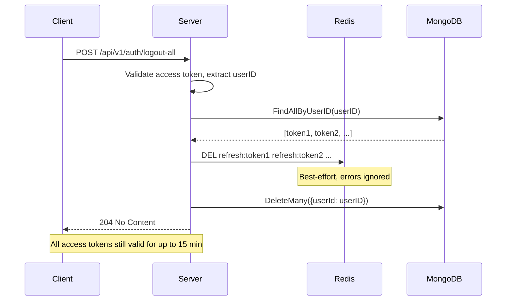
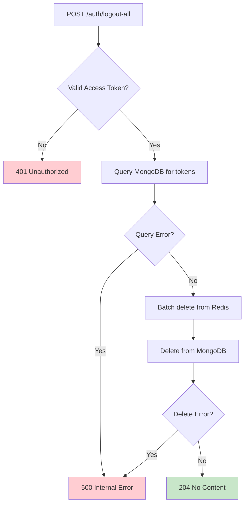

# Logout All Devices Specification

**Author**: Team
**Created**: 2025-12-25
**Status**: Implemented
**Architecture**: Query-then-Delete (MongoDB first, then Redis batch)

## Overview

Security feature that invalidates all refresh tokens for a user, forcing all devices to re-login. This provides users with a way to secure their account by terminating all active sessions.

## Architecture Decision

**Chosen Approach**: Option A - Query MongoDB first, then batch delete from Redis, then delete from MongoDB.

**Rationale**:
- Simple and reliable approach
- Uses existing MongoDB index on `userId` for efficient token lookup
- Batch Redis deletion is more efficient than individual deletes
- No additional data structures or token versioning required
- 15-minute window for existing access tokens is acceptable

### Files to Modify

| File | Changes |
| ---- | ------- |
| `internal/repository/refresh_token_repository.go` | Add `FindAllByUserID` method to interface and implementation |
| `internal/cache/redis.go` | Add `DeleteRefreshTokens(tokens []string)` for batch deletion |
| `internal/service/interfaces.go` | Add `LogoutAll` to `AuthServicer` interface |
| `internal/service/auth_service.go` | Add `LogoutAll` method implementation |
| `internal/handler/auth_handler.go` | Add `LogoutAll` handler with Swagger annotations |
| `internal/router/router.go` | Add route `POST /auth/logout-all` |
| `internal/service/mocks/mock_services.go` | Add `LogoutAllFunc` to MockAuthService |

## Data Model

No new data models required. Uses existing `RefreshToken` model:

### RefreshToken (Existing)

| Field     | Type     | Description                          |
| --------- | -------- | ------------------------------------ |
| id        | string   | Unique identifier (MongoDB ObjectID) |
| token     | string   | Opaque refresh token string          |
| userId    | string   | User ID (foreign key)                |
| expiresAt | datetime | When the refresh token expires       |
| createdAt | datetime | When the refresh token was created   |

**Existing Indexes Used:**
- `userId` - for finding all tokens for a user (already exists)

## API Endpoint

### Logout All Devices

Invalidate all refresh tokens for the authenticated user, forcing all devices to re-authenticate.

```
POST /api/v1/auth/logout-all
```

**Authentication:** Required (Bearer access token)

**Request Body:** None required

**Response:** `204 No Content`

**Behavior:**
1. Get user ID from JWT token in Authorization header
2. Query MongoDB for all refresh tokens belonging to the user
3. Batch delete all tokens from Redis cache (best-effort, errors ignored)
4. Delete all tokens from MongoDB
5. Return 204 No Content

**Note:** The current device's access token remains valid until expiry (max 15 min). All devices (including the current one) will need to re-authenticate when their access token expires.

#### Error Responses

| Status | Message | Description |
| ------ | ------- | ----------- |
| 401 | Unauthorized | Missing or invalid access token |
| 500 | Internal server error | Database operation failed |

**Idempotency:** Always returns 204, even if user has no active refresh tokens.

## Business Rules

1. **Scope**: Logs out ALL devices, including the current device making the request
2. **Access Token Window**: Existing access tokens remain valid for up to 15 minutes (their natural expiry)
3. **No Token Versioning**: Simple approach without token versioning complexity
4. **Best-Effort Cache Deletion**: Redis cache errors are ignored; tokens will expire naturally
5. **Future Integration**: Can be auto-triggered when user changes password (separate feature)

## Implementation Details

### Repository Layer

Add `FindAllByUserID` to `RefreshTokenRepository` interface:

```go
// RefreshTokenRepository interface addition
FindAllByUserID(ctx context.Context, userID primitive.ObjectID) ([]models.RefreshToken, error)
```

Implementation uses existing `userId` index for efficient lookup.

### Cache Layer

Add `DeleteRefreshTokens` to Redis client:

```go
// DeleteRefreshTokens removes multiple refresh tokens from cache.
func (r *Redis) DeleteRefreshTokens(ctx context.Context, tokens []string) error
```

Uses Redis DEL command with multiple keys for efficient batch deletion.

### Service Layer

Add `LogoutAll` to `AuthServicer` interface:

```go
// AuthServicer interface addition
LogoutAll(ctx context.Context, userID primitive.ObjectID) error
```

Service implementation flow:
```go
func (s *AuthService) LogoutAll(ctx context.Context, userID primitive.ObjectID) error {
    // 1. Get all tokens for user from MongoDB
    tokens, err := s.refreshTokenRepo.FindAllByUserID(ctx, userID)
    if err != nil {
        return err
    }

    // 2. Extract token strings
    tokenStrings := make([]string, len(tokens))
    for i, t := range tokens {
        tokenStrings[i] = t.Token
    }

    // 3. Batch delete from Redis (best-effort)
    if len(tokenStrings) > 0 {
        _ = s.cache.DeleteRefreshTokens(ctx, tokenStrings)
    }

    // 4. Delete all from MongoDB
    return s.refreshTokenRepo.DeleteByUserID(ctx, userID)
}
```

### Handler Layer

Add `LogoutAll` handler with Swagger annotations:

```go
// LogoutAll godoc
// @Summary      Logout from all devices
// @Description  Invalidate all refresh tokens for the authenticated user
// @Tags         auth
// @Produce      json
// @Success      204      "No Content"
// @Failure      401      {object}  response.Response
// @Failure      500      {object}  response.Response
// @Security     BearerAuth
// @Router       /auth/logout-all [post]
func (h *AuthHandler) LogoutAll(c *gin.Context) {
    userID := c.GetString("userID")
    // ... implementation
}
```

### Mock Service

Add `LogoutAllFunc` to MockAuthService:

```go
type MockAuthService struct {
    // ... existing fields
    LogoutAllFunc func(ctx context.Context, userID primitive.ObjectID) error
}

func (m *MockAuthService) LogoutAll(ctx context.Context, userID primitive.ObjectID) error {
    if m.LogoutAllFunc != nil {
        return m.LogoutAllFunc(ctx, userID)
    }
    return nil
}
```

## Technical Flow

### Logout All Devices Flow



### Error Handling Flow



## Implementation Steps

1. [x] Add `FindAllByUserID` to `RefreshTokenRepository` interface
2. [x] Implement `FindAllByUserID` in `refreshTokenRepository`
3. [x] Add `DeleteRefreshTokens` method to Redis client
4. [x] Add `LogoutAll` to `AuthServicer` interface
5. [x] Implement `LogoutAll` in `AuthService`
6. [x] Add `LogoutAllFunc` to `MockAuthService`
7. [x] Add `LogoutAll` handler with Swagger annotations
8. [x] Add route `POST /auth/logout-all` to protected auth routes
9. [x] Run `task swagger` to regenerate docs
10. [x] Run `go mod tidy` to clean up dependencies

## Out of Scope

- Token versioning (rejected in architecture decision)
- Immediate access token invalidation (would require stateful token validation)
- Password change auto-trigger (future integration point only)
- Per-device logout selection (logout individual devices)
- Session listing (view all active sessions)

## Open Questions

- [ ] Should we add an audit log for logout-all events?
- [ ] Should we send notification to other devices when logout-all is triggered?
