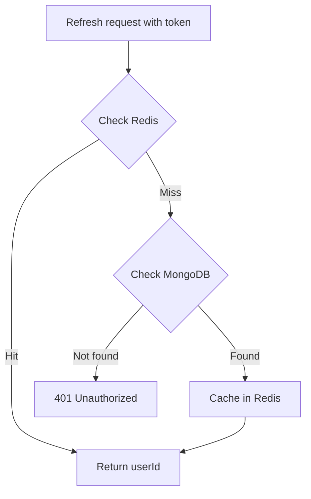
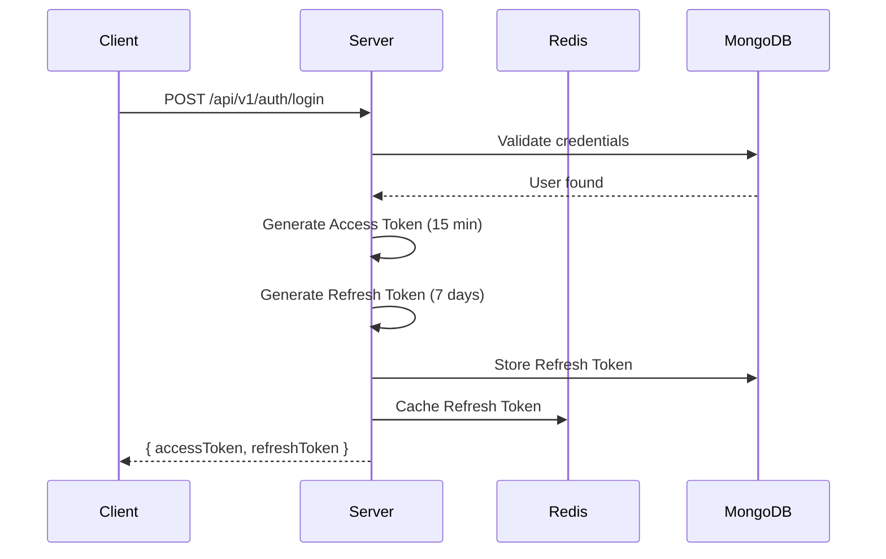
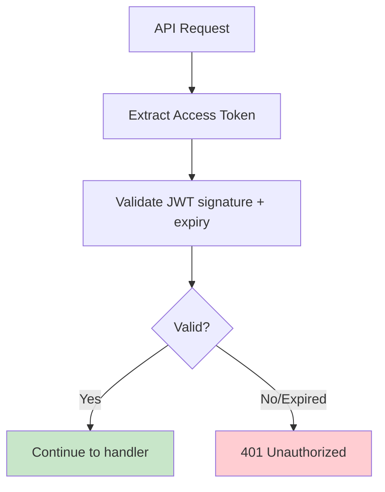
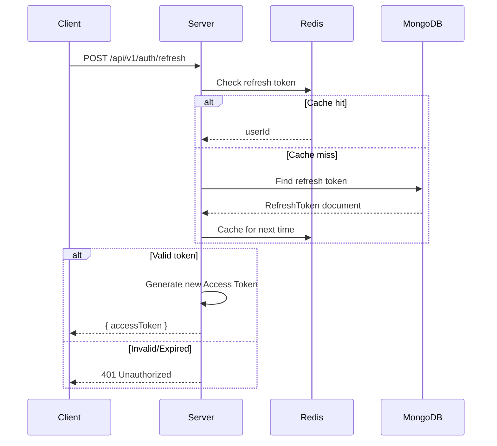
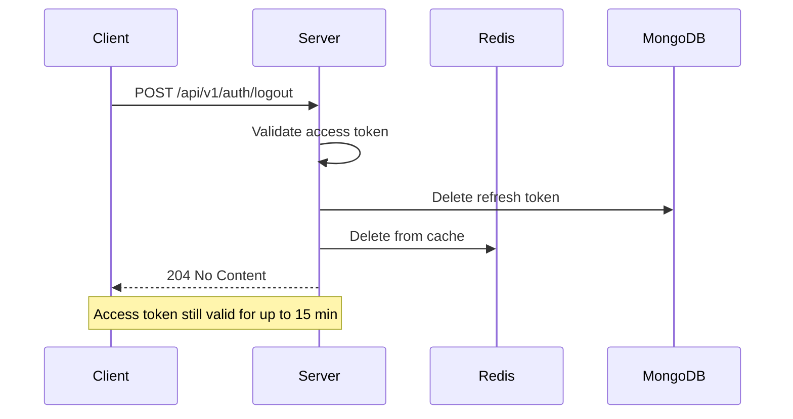

# Logout API Specification

**Author**: Team
**Created**: 2025-12-20
**Status**: Implemented

## Overview

API endpoint to logout users using access token + refresh token strategy. Access tokens are short-lived and stateless. Refresh tokens are long-lived and stored server-side. Logout invalidates the refresh token, and access tokens expire naturally.

**Note:** Client-side polling for session validity is out of scope for this backend implementation.

## Data Model

### RefreshToken (New Collection)

| Field     | Type     | Description                              |
| --------- | -------- | ---------------------------------------- |
| id        | string   | Unique identifier (MongoDB ObjectID)     |
| token     | string   | Opaque refresh token string              |
| userId    | string   | User ID (foreign key)                    |
| expiresAt | datetime | When the refresh token expires           |
| createdAt | datetime | When the refresh token was created       |

**Indexes:**
- `token` (unique) - for fast lookup during refresh
- `userId` - for finding all tokens for a user
- `expiresAt` (TTL index) - auto-cleanup of expired tokens

### JWT Claims (Access Token)

| Claim  | Type   | Description                  |
| ------ | ------ | ---------------------------- |
| userId | string | User's ID                    |
| exp    | int    | Expiration timestamp         |
| iat    | int    | Issued at timestamp          |

**Access Token TTL:** 15 minutes

## Storage Strategy

### Refresh Token Storage (Redis + MongoDB)

- **MongoDB**: Persistent storage of refresh tokens
- **Redis**: Cache for fast validation
  - Key format: `refresh:{token}`
  - Value: `userId`
  - TTL: Matches refresh token expiry (7 days)

### Lookup Flow



## Endpoints

### Login (Modified)

Returns both access token and refresh token.

```
POST /api/v1/auth/login
```

**Request Body:**
```json
{
  "email": "user@example.com",
  "password": "password123"
}
```

**Response:** `200 OK`
```json
{
  "success": true,
  "data": {
    "accessToken": "eyJhbG...",
    "refreshToken": "rf_8a7b3c9d...",
    "expiresIn": 900
  }
}
```

### Register (Modified)

Returns both access token and refresh token after registration.

```
POST /api/v1/auth/register
```

**Response:** `201 Created`
```json
{
  "success": true,
  "data": {
    "accessToken": "eyJhbG...",
    "refreshToken": "rf_8a7b3c9d...",
    "expiresIn": 900
  }
}
```

### Refresh Token (New)

Exchange refresh token for new access token.

```
POST /api/v1/auth/refresh
```

**Request Body:**
```json
{
  "refreshToken": "rf_8a7b3c9d..."
}
```

**Response:** `200 OK`
```json
{
  "success": true,
  "data": {
    "accessToken": "eyJhbG...",
    "expiresIn": 900
  }
}
```

**Errors:**

| Status | Description                                |
| ------ | ------------------------------------------ |
| 400    | Bad request - missing refresh token        |
| 401    | Unauthorized - invalid or expired token    |
| 500    | Internal server error                      |

### Logout (New)

Invalidate the refresh token.

```
POST /api/v1/auth/logout
```

**Authentication:** Required (Bearer access token)

**Request Body:**
```json
{
  "refreshToken": "rf_8a7b3c9d..."
}
```

**Response:** `204 No Content`

**Behavior:**
- Delete refresh token from MongoDB
- Delete refresh token from Redis cache
- Access token remains valid until expiry (max 15 min)

**Errors:**

| Status | Description                             |
| ------ | --------------------------------------- |
| 401    | Unauthorized - invalid or missing token |
| 500    | Internal server error                   |

**Idempotency:** Always returns 204, even if refresh token doesn't exist.

## Business Rules

1. **Token Lifetimes**
   - Access token: 15 minutes
   - Refresh token: 7 days

2. **Access Token Validation (Auth Middleware)**
   - Validate JWT signature
   - Check expiration
   - No database lookup required (stateless)

3. **Refresh Token Validation**
   - Check Redis cache first
   - Fall back to MongoDB on cache miss
   - Return 401 if not found or expired

4. **Logout Behavior**
   - Deletes refresh token from storage
   - Access token continues to work until expiry (max 15 min)
   - Logs out only the current session (other devices keep their refresh tokens)

5. **Refresh Token Generation**
   - Use cryptographically secure random string
   - Prefix with `rf_` for easy identification
   - Store hashed version in database (optional, for security)

## Implementation Touches

| File | Changes |
| ---- | ------- |
| `internal/models/refresh_token.go` | New RefreshToken struct |
| `internal/models/auth.go` | Update LoginResponse, add RefreshRequest |
| `internal/repository/refresh_token_repository.go` | New repository for refresh tokens |
| `internal/service/auth_service.go` | Add refresh token logic |
| `internal/handler/auth_handler.go` | Add Refresh and Logout handlers |
| `internal/router/router.go` | Add refresh and logout routes |
| `pkg/auth/jwt.go` | Update access token TTL to 15 min |
| `internal/cache/redis.go` | Add refresh token cache methods |

## Technical Notes

### Login Flow



### API Request Flow



**Note:** No database lookup required - access token is stateless.

### Token Refresh Flow



### Logout Flow



### Security Considerations

1. **Access Token**
   - Short-lived (15 min) limits exposure if stolen
   - Stateless validation (no DB lookup)
   - Stored in memory only (not localStorage)

2. **Refresh Token**
   - Long-lived but revocable
   - Should be stored securely (HttpOnly cookie recommended)
   - Can be rotated on each refresh (optional enhancement)

## Out of Scope

- Client-side polling for session validity
- SSE/WebSocket push notifications
- Token versioning
- Per-device session management
- Refresh token rotation
- "Logout from all devices" functionality

## Open Questions

- [x] Should refresh tokens be rotated on each refresh? → [GitHub Issue #34](https://github.com/geekmini/gin-memo/issues/34)
- [x] Should we implement "logout from all devices" in the future? → [GitHub Issue #35](https://github.com/geekmini/gin-memo/issues/35)
