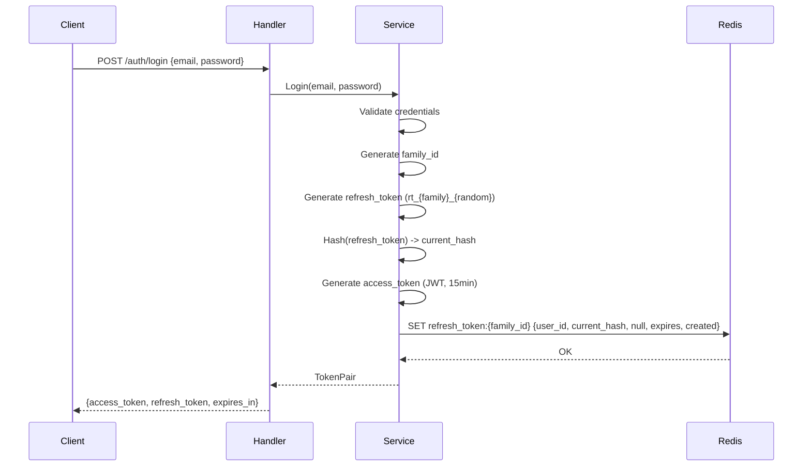
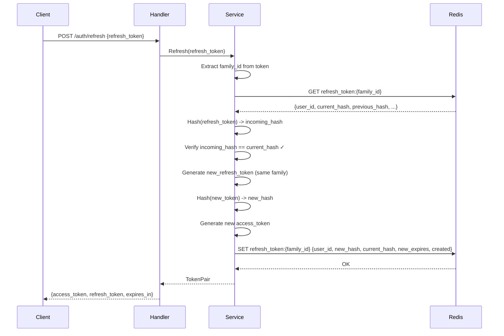
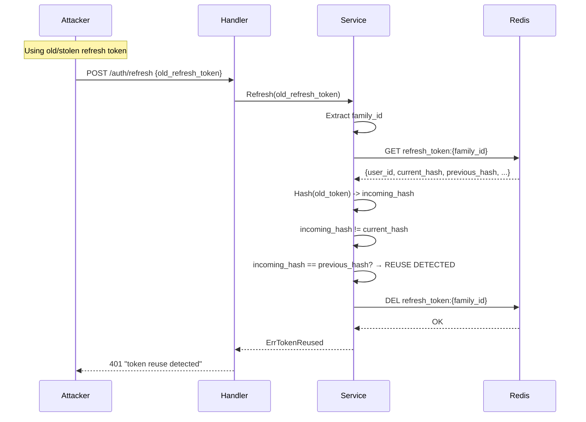
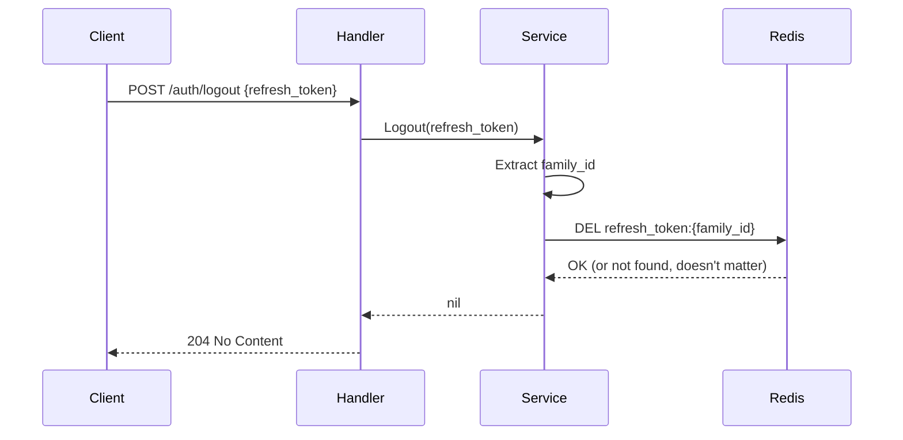

# Refresh Token Rotation Specification

**Author**: AI Assistant
**Created**: 2025-12-26
**Status**: Pending Implementation
**Issue**: [GitHub Issue #34](https://github.com/geekmini/gin-memo/issues/34)

## Overview

Implement refresh token rotation where each time a refresh token is used, it is invalidated and a new one is issued. This provides security benefits including limited reuse window, token theft detection, and minimized exposure duration.

**Architecture Choice**: Simplified Family Tracking (Option C)
- Single Redis key per session with embedded family ID
- 1-token lookback for reuse detection
- Good balance of security and implementation complexity

## Requirements

### Functional Requirements

1. Generate refresh tokens alongside access tokens during login/register
2. Exchange refresh token for new access token + new refresh token (rotation)
3. Invalidate used refresh tokens immediately after rotation
4. Detect refresh token reuse (token already rotated = potential theft)
5. Invalidate token family on reuse detection
6. Support explicit logout (invalidate refresh token family)

### Non-Functional Requirements

1. Access token TTL: **15 minutes**
2. Refresh token TTL: **7 days**
3. Storage: **Redis only** (no MongoDB for tokens)
4. Breaking API change: rename `token` to `access_token` in responses

### Out of Scope (MVP)

- Rate limiting on refresh endpoint
- Per-device session tracking
- Logout from all devices
- Token binding (IP/device)

## Data Model

### Redis Key Structure

```
Key:    refresh_token:{family_id}
Value:  JSON {
          "user_id": "string",
          "current_token_hash": "string (SHA-256)",
          "previous_token_hash": "string | null",
          "expires_at": "RFC3339 timestamp",
          "created_at": "RFC3339 timestamp"
        }
TTL:    7 days (reset on each rotation)
```

### Refresh Token Format

```
rt_{family_id}_{random_bytes}
```

- `rt_` prefix for easy identification
- `family_id`: 16-character hex string (8 bytes)
- `random_bytes`: 32-character hex string (16 bytes)
- Total: ~52 characters

Example: `rt_a1b2c3d4e5f67890_1234567890abcdef1234567890abcdef`

### Token Pair Response

```go
type TokenPairResponse struct {
    AccessToken  string `json:"access_token"`
    RefreshToken string `json:"refresh_token"`
    ExpiresIn    int    `json:"expires_in"`  // Access token TTL in seconds
}
```

## API Changes

### Login Response (Breaking Change)

**Before:**
```json
{
  "success": true,
  "data": {
    "token": "eyJhbG...",
    "user": { ... }
  }
}
```

**After:**
```json
{
  "success": true,
  "data": {
    "access_token": "eyJhbG...",
    "refresh_token": "rt_a1b2c3d4...",
    "expires_in": 900,
    "user": { ... }
  }
}
```

### Register Response (Breaking Change)

Same structure as Login response with `201 Created` status.

### New: Refresh Endpoint

```
POST /api/v1/auth/refresh
```

**Request:**
```json
{
  "refresh_token": "rt_a1b2c3d4e5f67890_1234567890abcdef1234567890abcdef"
}
```

**Success Response (200 OK):**
```json
{
  "success": true,
  "data": {
    "access_token": "eyJhbG...",
    "refresh_token": "rt_new_family_new_random...",
    "expires_in": 900
  }
}
```

**Error Responses:**

| Status | Error | Description |
|--------|-------|-------------|
| 400 | "refresh_token is required" | Missing refresh token in request |
| 401 | "invalid refresh token" | Token not found or malformed |
| 401 | "refresh token expired" | Token family TTL exceeded |
| 401 | "token reuse detected" | Already-rotated token used again |

### New: Logout Endpoint

```
POST /api/v1/auth/logout
```

**Authentication:** Required (Bearer access token)

**Request:**
```json
{
  "refresh_token": "rt_a1b2c3d4e5f67890_..."
}
```

**Success Response:** `204 No Content`

**Behavior:**
- Delete refresh token family from Redis
- Always returns 204 (idempotent), even if token doesn't exist

## Token Rotation Flow

### Login Flow



### Refresh Flow (Happy Path)



### Refresh Flow (Reuse Detection)



### Logout Flow



## Implementation Components

### New Files

| File | Purpose |
|------|---------|
| `pkg/auth/refresh_token.go` | RefreshTokenGenerator: Generate(), ExtractFamilyID(), Hash() |
| `internal/cache/refresh_token_store.go` | RefreshTokenStore interface + Redis implementation |
| `internal/models/token.go` | RefreshTokenData, TokenPair, RefreshRequest, LogoutRequest |

### Modified Files

| File | Changes |
|------|---------|
| `internal/config/config.go` | Add `AccessTokenTTL`, `RefreshTokenTTL` |
| `internal/errors/errors.go` | Add `ErrInvalidRefreshToken`, `ErrRefreshTokenExpired`, `ErrTokenReused` |
| `internal/models/auth.go` | Update `AuthResponse` to include both tokens |
| `internal/service/auth_service.go` | Add `Refresh()`, `Logout()`, update `Login()`, `Register()` |
| `internal/handler/auth_handler.go` | Add `Refresh()`, `Logout()` handlers |
| `internal/router/router.go` | Add `/auth/refresh`, `/auth/logout` routes |
| `cmd/server/main.go` | Wire RefreshTokenStore, update JWTManager TTL |
| `.env.example` | Add `ACCESS_TOKEN_TTL`, `REFRESH_TOKEN_TTL` |

## Component Details

### RefreshTokenGenerator (`pkg/auth/refresh_token.go`)

```go
type RefreshTokenGenerator interface {
    Generate() (token string, familyID string, err error)
    ExtractFamilyID(token string) (string, error)
    Hash(token string) string
}

type refreshTokenGenerator struct{}

func NewRefreshTokenGenerator() RefreshTokenGenerator
func (g *refreshTokenGenerator) Generate() (string, string, error)     // Returns "rt_{family}_{random}", familyID
func (g *refreshTokenGenerator) ExtractFamilyID(token string) (string, error)
func (g *refreshTokenGenerator) Hash(token string) string              // SHA-256 hex
```

### RefreshTokenStore (`internal/cache/refresh_token_store.go`)

```go
type RefreshTokenData struct {
    UserID            string    `json:"user_id"`
    CurrentTokenHash  string    `json:"current_token_hash"`
    PreviousTokenHash string    `json:"previous_token_hash,omitempty"`
    ExpiresAt         time.Time `json:"expires_at"`
    CreatedAt         time.Time `json:"created_at"`
}

type RefreshTokenStore interface {
    Create(ctx context.Context, familyID string, data *RefreshTokenData, ttl time.Duration) error
    Get(ctx context.Context, familyID string) (*RefreshTokenData, error)
    Rotate(ctx context.Context, familyID string, newHash string, ttl time.Duration) error
    Delete(ctx context.Context, familyID string) error
}
```

### Config Changes (`internal/config/config.go`)

```go
type Config struct {
    // ... existing fields ...
    AccessTokenTTL  time.Duration  // Default: 15 minutes
    RefreshTokenTTL time.Duration  // Default: 7 days (168 hours)
}
```

### Error Definitions (`internal/errors/errors.go`)

```go
var (
    ErrInvalidRefreshToken  = errors.New("invalid refresh token")
    ErrRefreshTokenExpired  = errors.New("refresh token expired")
    ErrTokenReused          = errors.New("token reuse detected")
)
```

### AuthService Changes (`internal/service/auth_service.go`)

```go
type AuthService interface {
    Register(ctx context.Context, username, password string) (*models.AuthResponse, error)
    Login(ctx context.Context, username, password string) (*models.AuthResponse, error)
    Refresh(ctx context.Context, refreshToken string) (*models.TokenPairResponse, error)  // NEW
    Logout(ctx context.Context, refreshToken string) error                                 // NEW
}
```

## Configuration

### Environment Variables

```env
# Token durations
ACCESS_TOKEN_TTL=15m
REFRESH_TOKEN_TTL=168h
```

### Default Values

| Variable | Default | Description |
|----------|---------|-------------|
| ACCESS_TOKEN_TTL | 15m | Access token lifetime |
| REFRESH_TOKEN_TTL | 168h | Refresh token lifetime (7 days) |

## Security Considerations

1. **Token Hashing**: Store only SHA-256 hashes of refresh tokens in Redis
2. **Cryptographic Randomness**: Use `crypto/rand` for token generation
3. **Constant-time Comparison**: Use `subtle.ConstantTimeCompare` for hash validation
4. **Short Access Token**: 15-minute lifetime limits exposure if stolen
5. **Reuse Detection**: 1-token lookback detects immediate token theft
6. **Family Invalidation**: On reuse detection, entire family is deleted

## Testing Requirements

### Unit Tests

- [ ] RefreshTokenGenerator.Generate() produces valid format
- [ ] RefreshTokenGenerator.ExtractFamilyID() parses correctly
- [ ] RefreshTokenGenerator.Hash() is consistent
- [ ] RefreshTokenStore operations (with mock Redis)
- [ ] AuthService.Refresh() rotation logic
- [ ] AuthService.Refresh() reuse detection

### Integration Tests

- [ ] Refresh token Redis operations
- [ ] Concurrent refresh requests

### API Tests

- [ ] Login returns both tokens
- [ ] Register returns both tokens
- [ ] Refresh with valid token rotates successfully
- [ ] Refresh with invalid token returns 401
- [ ] Refresh with expired family returns 401
- [ ] Refresh with already-rotated token triggers reuse detection
- [ ] Logout invalidates refresh token
- [ ] Logout is idempotent

## Implementation Order

1. `internal/config/config.go` - Add token TTL configs
2. `internal/errors/errors.go` - Add token errors
3. `internal/models/token.go` - Add token structs
4. `internal/models/auth.go` - Update AuthResponse
5. `pkg/auth/refresh_token.go` - Create token generator
6. `internal/cache/refresh_token_store.go` - Create token store
7. `internal/service/auth_service.go` - Add Refresh/Logout, update Login/Register
8. `internal/handler/auth_handler.go` - Add handlers
9. `internal/router/router.go` - Add routes
10. `cmd/server/main.go` - Wire dependencies
11. `.env.example` - Add config examples
12. `task swagger` - Regenerate API docs
13. Write tests

## Migration Notes

This is a **breaking change** for API clients:

1. **Response format change**: `token` → `access_token`
2. **New field**: `refresh_token` in auth responses
3. **New endpoints**: `/auth/refresh`, `/auth/logout`

Clients must update to:
1. Extract `access_token` instead of `token`
2. Store `refresh_token` securely
3. Implement token refresh logic before access token expires
4. Call refresh endpoint to get new token pair

## References

- [OAuth 2.0 Security Best Practices](https://datatracker.ietf.org/doc/html/draft-ietf-oauth-security-topics)
- [Auth0 Refresh Token Rotation](https://auth0.com/docs/secure/tokens/refresh-tokens/refresh-token-rotation)
- [RFC 6749 - OAuth 2.0](https://datatracker.ietf.org/doc/html/rfc6749)
